

  

# Datinate

Datinate is an open-source curation and export tool for building maintainable software collections from multiple DAT sources for the same platform. It automatically recommends how entries from sources such as No-Intro, Redump, MAME Software Lists, and other software DATs should be grouped into families, games, and parts, then lets the user review and promote those recommendations into a curated structure.

That curated structure becomes the foundation for export. Datinate can generate synchronised software and media DATs on a family basis, preserving the relationship between software entries and their associated screenshots, videos, manuals, covers, and other assets. Media assignment is optional, but when used it means software and media are exported from the same curated model rather than maintained as disconnected datasets.

This is especially valuable when source DATs change. Datinate can compare new automated groupings against existing curated families, report differences, and invite reassignment where needed. Instead of rediscovering a platform from scratch after every source update, users get a reviewable maintenance workflow for keeping cross-DAT software and media collections aligned over time.

## Philosophy

Datinate is built on the assumption that good curation still requires human judgement. The initial work of reviewing recommendations and building curated families, games, and parts has to be done carefully. Datinate’s value is that this effort is captured as a reusable project model: future DAT updates can be compared against the curated structure, media can be aligned to the same family relationships, and software and media exports can be regenerated without starting again.

Datinate is intended for users and projects that are willing to invest in careful curation. It may not suit workflows where the goal is immediate, fully automatic output with no review step. Its value appears when a platform needs to be maintained over time: when source DATs change, media sets improve, naming conventions shift, or exports need to be regenerated consistently from a trusted curated model.

## Key Features

- Import multiple software DAT sources for the same platform.
- Automatically recommend families, games, and parts.
- Review and promote automated groupings into curated structures.
- Compare updated DAT sources against existing curated work.
- Reassign changed or unmatched parts through review reports.
- Optionally assign screenshots, videos, manuals, covers, and other media during curation.
- Export synchronised software and media DATs on a family basis.
- Preserve curated relationships across software, media, playlists, and frontend-ready outputs.

## Status

Datinate is currently in its initial public release phase. The code is available under the MIT License, but pull requests are not currently being accepted while the project, documentation, and release process stabilise.

The export system is ambitious and currently experimental. Community feedback is welcome, especially around real-world DAT grouping, media assignment, and exported DAT compatibility.

## Requirements

- Windows 10 or Windows 11.
- x64 system architecture.
- A local DAT collection to scan.
- Optional media/resource DAT collections for media-assisted curation and media export.

## Download

Download the latest release from the GitHub Releases page.

The source code is provided under the MIT License.

---

# Basic Walkthrough: Software Curation

## First Launch

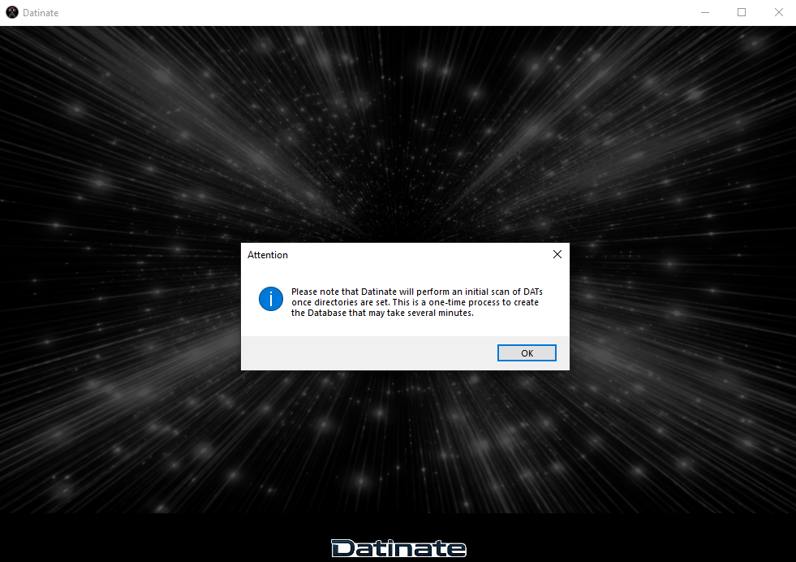

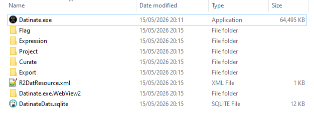

Datinate automatically creates a local database and application structure when it is run for the first time.

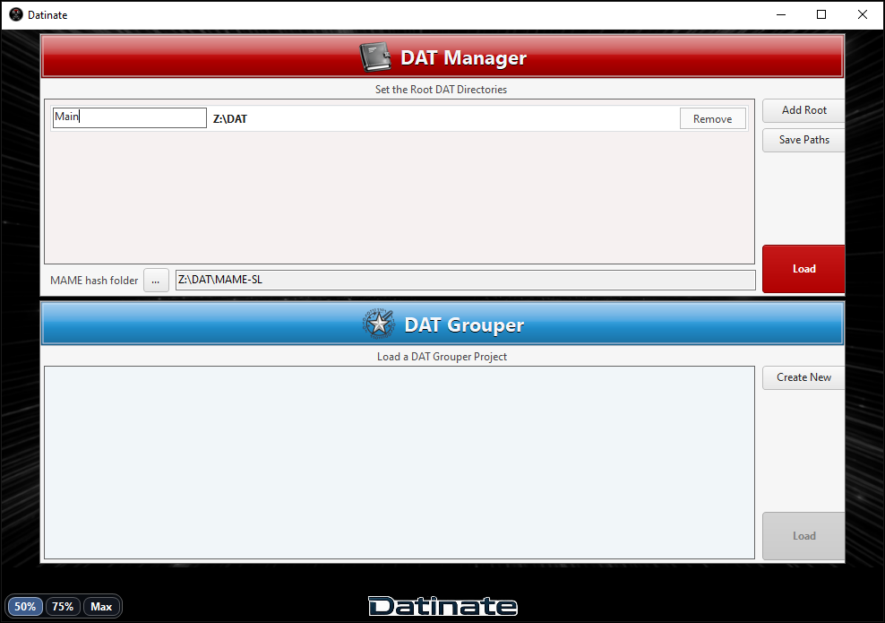

The app landing page will then appear.

Set the MAME hash folder to point to the MAME Software List XML files. Set at least one DAT root path and give each path a reference name. Click **Save Paths**, then click **Load** to create the DAT database.

The first run may take several minutes depending on the number of DATs being scanned.

## DAT Manager

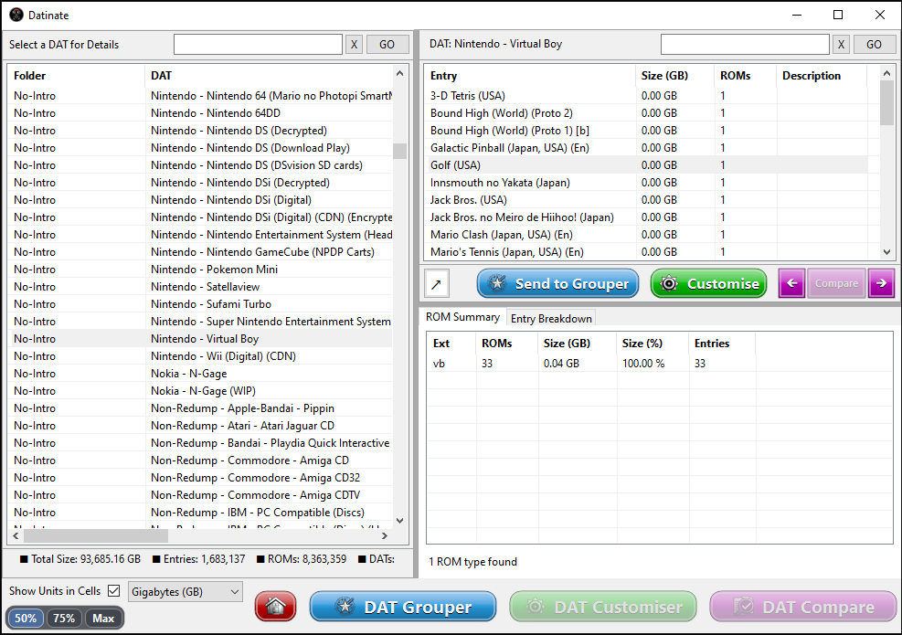

Once loading is complete, Datinate opens the DAT Manager page.

From here, select a DAT on the left to view entries and breakdowns in the right-hand tables. Click **DAT Grouper** at the bottom of the app to open the DAT Grouper Projects page.

## Create a DAT Grouper Project

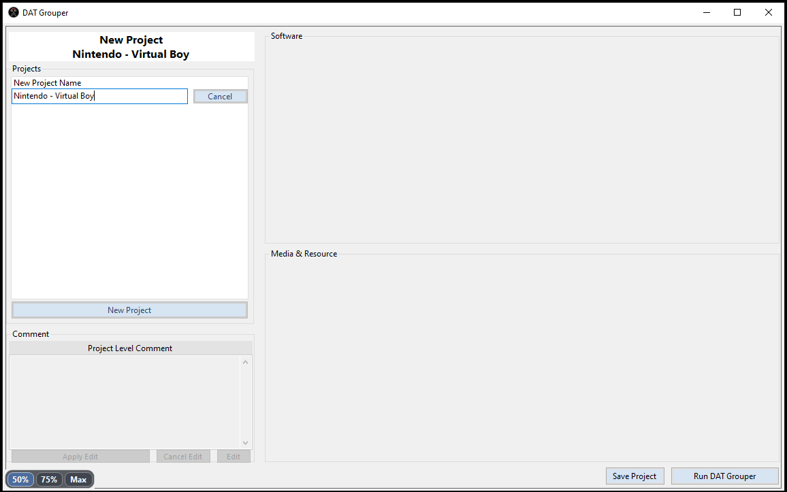

Create a new DAT Grouper project and click **Save Project**.

## Add Software DATs to the Project

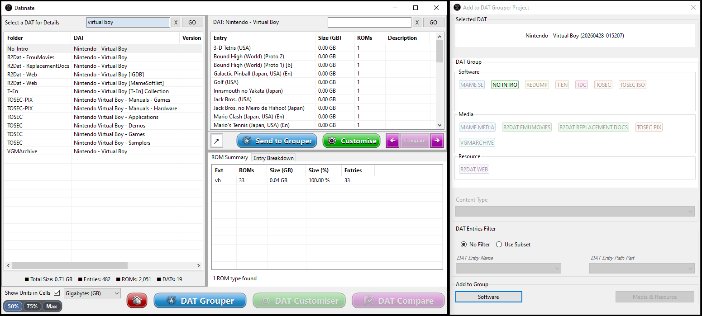

Return to the DAT Manager page and select a software DAT.

In this example, a Nintendo Virtual Boy DAT Grouper project is being created. Click **Send to Grouper** to open the **Add to DAT Grouper Project** form. Select the corresponding DAT group for your chosen DAT, then click **Add to Group > Software**.

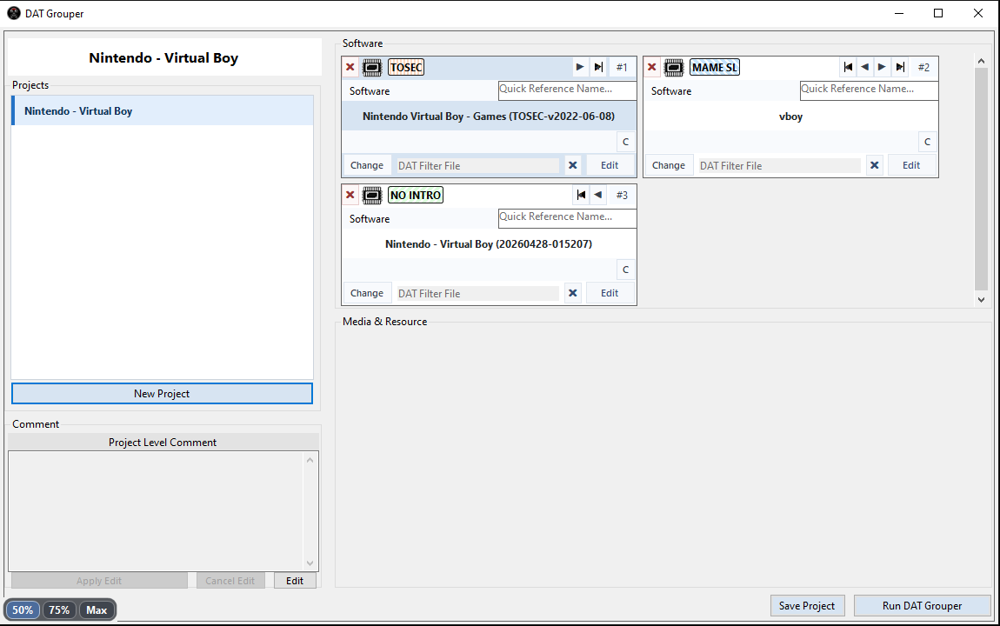

The DAT Grouper Projects page will be brought to the front.

Repeat this process to include multiple DATs for the same platform from multiple DAT groups. When ready, save your changes and click **Run DAT Grouper**.

## Review the Automated Set

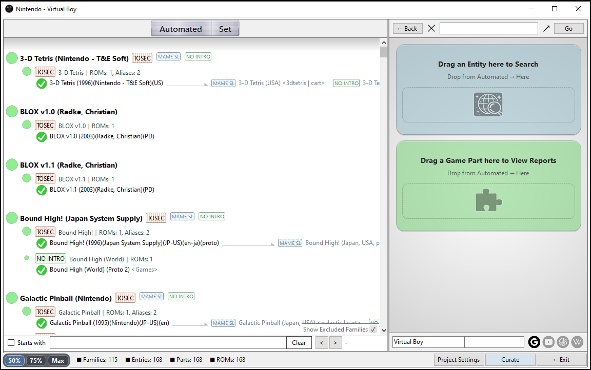

DAT Grouper will do its best to group families, games, and game parts automatically.

You can drag game parts from the **Automated Set** area and drop them onto the **View Reports** card on the right. This provides a breakdown of how the automated grouping service interpreted the part and its relationship within the set.

## Build the Curated Set

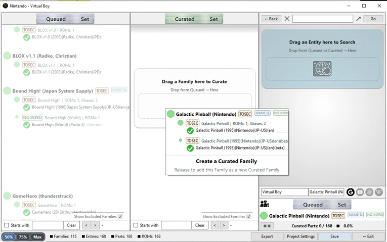

Click **Curate** to open the **Curated Set** section. The **Automated Set** section will now be named **Queued Set**.

Drag families from the Queued Set into the Curated Set to start building the project. Once the first family has been added, games and game parts can be moved between panels. Families can also be merged.

Save curated changes regularly.

## Review Changes After DAT Updates

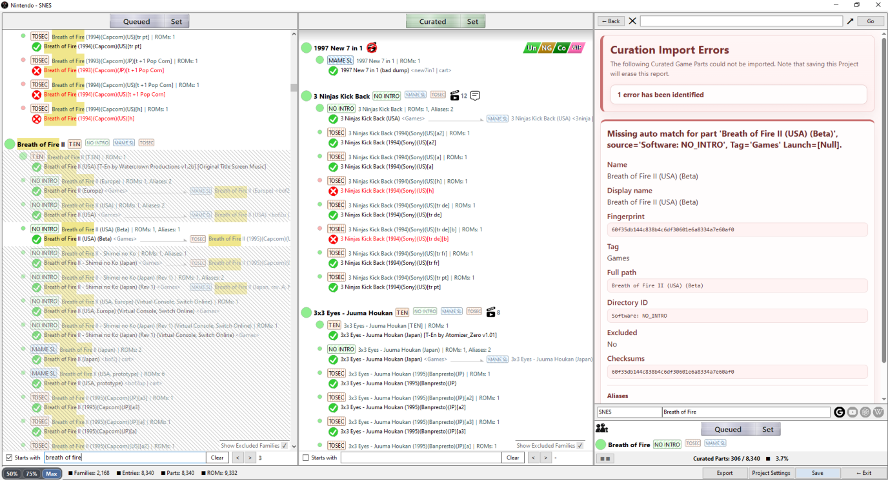

As the software DATs in a DAT Grouper project are updated, some curated game parts may become defunct. This can happen because of a minor spelling change, a renamed dump, or a larger change such as a good dump replacing a bad version.

When this happens, DAT Grouper reports the changes so they can be reviewed and reassigned rather than manually rediscovered.

## Export the Project

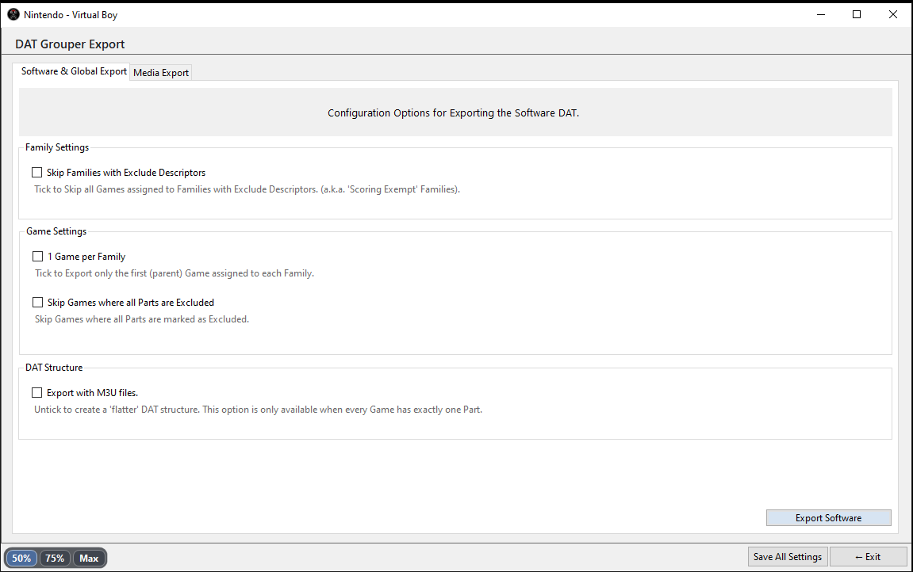

Once the Curated Set contains at least one family, the DAT Grouper project can be exported by clicking **Export**.

Datinate’s export technology is powerful but experimental. Community feedback is welcome.

---

# Intermediate Walkthrough: Media and Resources

## Add Media and Resource DATs

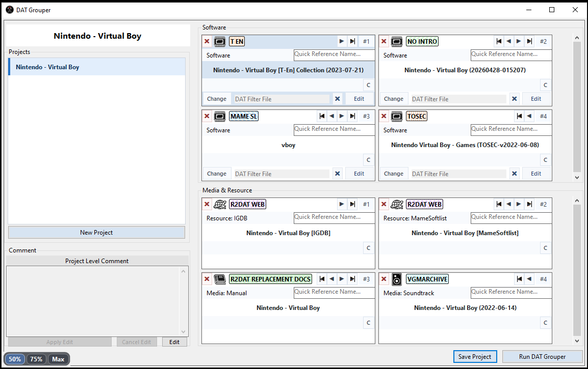

Datinate and the DAT Grouper facility can add media and resource DATs as well as software DATs. They are added through the DAT Manager page in the same way as software DATs.

Many media DAT sets are available through DATVault via RomVault. These include resources such as VGMArchive and ReplacementDocs DATs.

Resource DATs are slightly different from media DATs, but they serve the same broad purpose: providing auxiliary information for games. Resource DATs may include descriptions, credits, release information, box art, manuals, screenshots, and other supporting material.

Snapshots of resource sets and their DATs are currently available here:

https://mega.nz/folder/cGgRQaSL#4jGAxCtYhOspFmVHOYAsYA

Recent snapshots are available for:

- Nintendo - SNES
- Nintendo - Virtual Boy
- Sony - PlayStation

These currently include resources derived from sources such as:

- IGDB: https://www.igdb.com/
- MAME Software Lists: https://github.com/mamedev/mame/tree/master/hash

## Set Content Paths

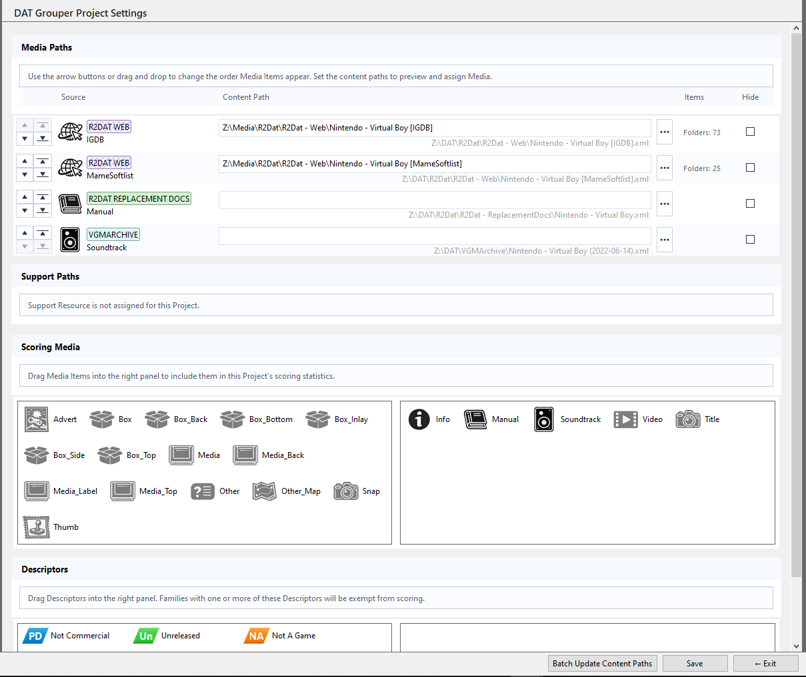

Once media and resource DATs have been added, Datinate provides the option to set content paths for that content.

To access this page:

1. Load the DAT Grouper project.
2. Click **Customise**.
3. Click **Project Settings** in the bottom-right corner.
4. Save the project settings.
5. Exit the project.

## Assign Media During Curation

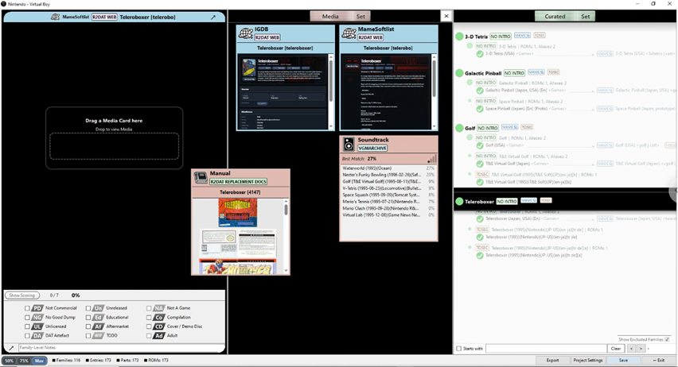

Reload the DAT Grouper project and return to the customisation area.

A new panel will be available for media and resource assignment. Drag a game family from one of the sets to start assigning media and resources.

While in Media Mode, resources, manuals, videos, screenshots, and other content can be dragged into the media viewer for inspection. This allows media to be reviewed while curation decisions are being made.

Save the DAT Grouper project regularly while assigning media.

---

# Advanced Walkthrough: DAT Customisation

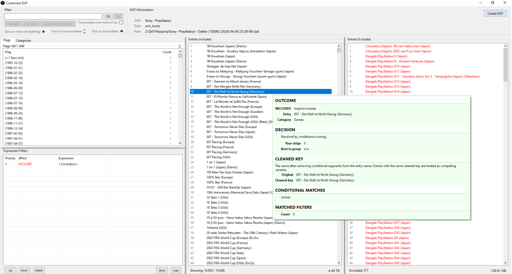

Datinate includes a DAT Customisation facility that allows game parts to be filtered out before they are promoted into the DAT Grouper customisation set.

An older but still useful introduction to this technology is available here:

https://www.youtube.com/watch?v=GMBZSiNpPBs

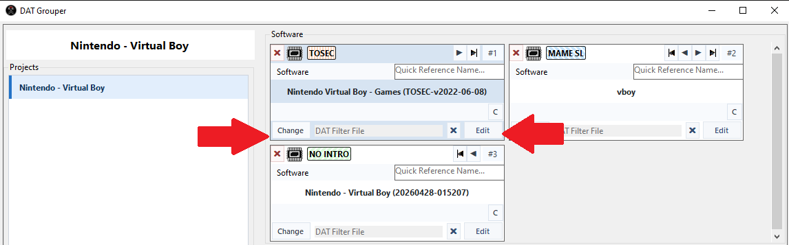

Customisation filters can be created and adjusted from the DAT Grouper Projects page.

---

# Known Issues

- Loading large DATs, such as MAME `listxml`, is slow and currently provides little or no progress information.
- DATs with CHDs can be loaded and used in DAT Grouper projects, but CHD DATs cannot yet be created directly in Datinate.
- Sometimes the **Rendering** overlay does not disappear when resizing forms. Clicking the overlay should hide it.
- DAT Grouper projects cannot currently be deleted through the UI. To delete a project manually, delete the corresponding XML files in the `Project` and `Curate` folders.
- Software export is experimental. Community feedback is welcome.
- A previously observed issue may occur when a DAT Grouper project is loaded and one or more DAT paths need to be updated. If a blank update form appears, restart the app and load the project again.

# Roadmap

- Show media scoring statistics in the media export screen.
- Improve progress reporting when loading large DATs.
- Improve DAT Grouper project management from the UI.
- Continue refining export compatibility and reporting.
